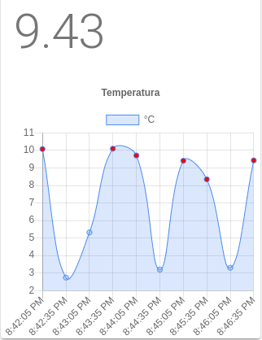

Funcionalidades
===============

Monitoramento
--------------

Dado que cada máquina possui um conjunto de sensores, o BSM pode:

- Mostrar o valor atual de cada sensor.
- Mostrar os valores históricos de cada sensor.

Telemetria
----------

A funcionalidade de telemetria mostra graficamente as oscilações de um sensor.

Vejamos um exemplo de um sensor de temperatura, o eixo "x" mostra o tempo, o eixo "y" o valor e os pontos vermelhos as anomalias.

Relatórios
----------

Dado um intervalo de tempo o BSM pode gerar relatórios destacando pontos importantes como: 
maior valor, menor valor e período de estabilização.

Detecção de Anomalias
---------------------

Um sensor pode ser configurado para ter um intervalo de valor aceitável. Caso um valor fora do intervalo aceitável seja
atingido o BSM pode detectar a anomalia e notificar usuários através do envio de e-mails.
